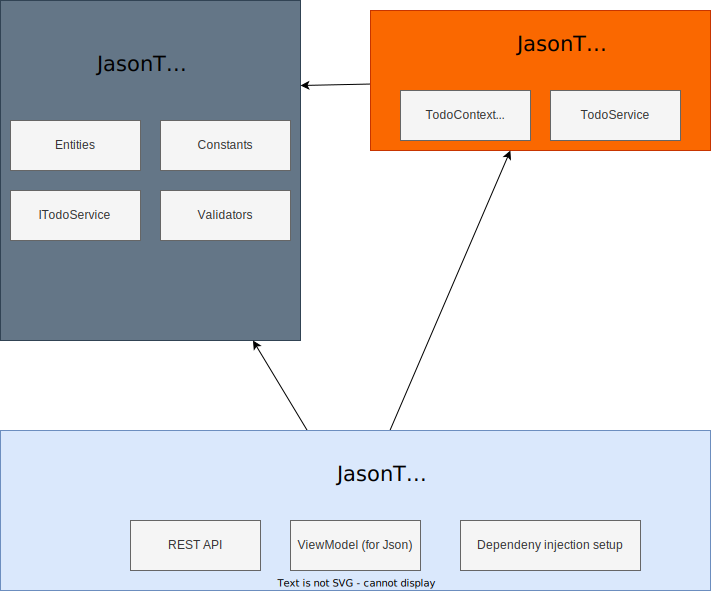

# Todo API

Simple Todo REST API implemented with minimal API
- Swagger support
- Unit testing with Sqlite in Memory
- Integration testing with Sqlite in Memory. 
- Basic CI in the github Action.

## Tech stack and development tool

- .NET 7
- Visual Studio
- Visual Studio Code
- dotnet cli for .NET 7.0
- git
- SQLite

**SQLite**

- For development and production, the database is using `todo.db` inside `$ENV:LOCALAPPDATA`
- For unit testing, integration testing, the database is using SQLite in memory

## Getting started for development

.NET 7 is cross platform so you can run on Winodws, Mac and Linux, and even Github Codespace

### Install required tool and clone the repo

- [Download git](https://git-scm.com/)
- [Download Dotnet SDK for .NET7](https://dotnet.microsoft.com/en-us/download)

```
git clone https://github.com/Jasonlhy/todo-api.git
cd todo-api
```

### Provision database for development

This application request a database, you can provision the database either with command or when application starts

**Provision the database with command**

Run following in powershell, it will generate the `todo.db` inside `$ENV:LOCALAPPDATA`

```powershell
dotnet tool install --global dotnet-ef
dotnet ef database update -p ./JasonTodoInfrastructure -s ./JasonTodoApi
```

**Provision the database when application start**

Uncomment following code

```
// Provision the database in case if you need to do in application start ... 
//using (var scope = app.Services.CreateScope())
//{
//    var provider = scope.ServiceProvider;
//    using var todoContext = provider.GetRequiredService<TodoContext>();
//    todoContext.Database.EnsureCreated();
//}
```

### Running with Visual Studio

1. [Download Visual Studio 2022](https://visualstudio.microsoft.com/vs/) with C# component
2. Open the solution in Visual Studio 2022
3. Set JasonTodoApi as startup project, press the run button

### Running with Visual Studio Code

1. [Download Visual Studio code and install C# extensions](https://code.visualstudio.com/docs/languages/csharp)
2. Open the folder and run debug

### Running with dotnet cli

1. Use any editor you like
2. `dotnet run JasonTodoApi`

- https://localhost:7124/swagger/index.html
- http://localhost:5162/swagger/index.html

### Running on Github Codespace

It is the easiest way to test the project, just open the project in Github codespace, the codespace will have dotnet cli installed and will provision the database, so you can run following command, the set up is defined inside `.devcontainer`

```bash
dotnet run JasonTodoApi
```

## API Design

Following show the basic example of the todo api, for details please check the integration testing.

## Common design

- Only json will be used request content and response content, it will not supporting XML
- status is passed as integer instead of string, 0 for non started, 1 for in progress, 2 for completed
- dueDate inside request and response JSON is in ISO 8601 format, e.g. `2023-05-19T23:31:35.436Z`

For common error validation error, it will return 400 and in following structure

```json
{
  "errorCode": 3,
  "errorMessages": [
    "9999 is not valid status"
  ]
}
```

### Get todo list with filtering and sorting

Route: `GET /todos?[dueDate=2023-05-21T13%3A00%3A00.0000000][&name=22][&status=1][&sortBy=name][&sortAsec=true]`

Return a list of todo item
- Can be filtered by name,status,dueDate, filtering is done by exact match
- Can be sorted by a column, either ascending or descending

Optional parameter in query string:
- dueDate: for filtering, must be in in ISO DateString format
- name: for filtering
- status: for filtering
- status: 0 for non started, 1 for in progress, 2 for completed
- sortBy: sort by which field, values: name, dueDate, stats
- sortAsc: is sorted ascending or descending, values: true or false

Example request:

`GET /todos`

Example response:

```json
[
  {
    "id": 2,
    "name": "string",
    "description ": "string",
    "dueDate": "2023-05-19T23:26:24.058",
    "status": 0,
    "statusString": "Not Started"
  },
  {
    "id": 4,
    "name": "string2",
    "description ": "string",
    "dueDate": "2023-05-19T23:31:35.436",
    "status": 0,
    "statusString": "Not Started"
  },
]
```

Example request with filtering by name:

`GET /todos?name=string`

Example response with filtering by name:

```json
[
  {
    "id": 2,
    "name": "string",
    "description ": "string",
    "dueDate": "2023-05-19T23:26:24.058",
    "status": 0,
    "statusString": "Not Started"
  }
]
```

### Get todo details

Get todo detail of a given todo id

Route: `GET /todos/{id}`

Example response:

`GET /todos/2`

```json
[
  {
    "id": 2,
    "name": "string",
    "description ": "string",
    "dueDate": "2023-05-19T23:26:24.058",
    "status": 0,
    "statusString": "Not Started"
  }
]
```

### Create todo

Create todo item, it will return the new created todo item in JSON

Example request:

`POST /todos`

```json
{
  "name": "string",
  "description": "string",
  "dueDate": "2023-05-20T22:00:29.787Z"
}
```

Example response:

Status Code: 201

```json
{
  "id": 22,
  "name": "string",
  "description ": "string",
  "dueDate": "2023-05-21T13:00:00Z",
  "status": 0,
  "statusString": "Not Started"
}
```

### Update todo

Update the todo with given Id

Route: `PUT /todos/{id}`

Example request:

`PUT /todos/1`

```json
{
  "name": "string",
  "description ": "string",
  "dueDate": "2023-05-21T13:00:00Z",
  "status": 0
}
```

Example response:

- Status Code: 200
- Content body: None

### Delete todo

Given a todo id, delete the todo item.

Route: `DELETE /todos/{id}`

Example request:

`DELETE /todos/1`

Example response: 

- Status Code: 200
- Content body: None

Example request 2  (Non existing Id)

`DELETE /todos/9999`

Example response 2:

- Status Code: 404
- Content body: None

## Application Design

The application consists of 3 layers

- JasonTodoCore: Main application logic, this mainly for POCO, high level interface such as TodoService, constant, validation rule, it doesn't have dependency except BCL
- JasonTodoInfrastructure: Data Access Layer, and the implementation of TodoService, it depends on JasonTodoCore
- JasonTodoApi: The REST API end point for accepting the request, after accepting the HTTP request, it uses the library from JasonTodoCore and JasonTodoInfrastructure to handle the logic then response to user




Idea:

- Main logic is handled in the JasonTodoCore, and TodoService 
- Infrastructure layer is for external resource such as database, data access layer heavily depends on EntityFrameworkCore so I don't need to write the SQL for dynamic filtering and sorting
- I added some length constraint on the data so there are extra code in core for checking those constraints

Workflow:

JasonTodoApi will set the dependency injection of ITodoService, and the TodoContext

1. Handle REST API in JasonTodoApi
2. RequestValidation (No db logic involved, purely computation)
3. EntityValidation (More rule, some rule may be related to data size constraint)
4. Call ITodoService to do the actual work
5. Return the return 

## Unit Testing

- JasonTodoCore.UnitTest: Test the mapper, validation logic
- JasonTodoInfrastructure.UnitTest: Test the implementation of IGEService, the unit test is running with SQLite in memory, the data is isolated between each test case
- JasonTodoApi.UnitTest: Test the mapper

## Integration Testing

REST API integration testing

1. It will start up a test server
2. REST API call to the server 
3. Assert the result such as response body and status code

## Entity Framework Core migration

THe initial database schema is created with Entity Framework Core migration

```
dotnet tool install --global dotnet-ef
dotnet add package Microsoft.EntityFrameworkCore.Design
dotnet ef migrations add InitialCreate
```

## Common Pattern in code
- Nullable reference
- use const instead of enum for status
- ViewModel will be defined as record
- use required field keyword

## Trade off and design consideration
 
- I don't like to use AutoMapper, so I write the mapper myself, and write the test case ...
- The TodoService implementation directly depends on Entity Framework context because I know it is easy to use SQLite and in-memory database with entity framework to test.
I can put the TodoService in the Core but I have to abstract a repository pattern for providing the data. [Further Reading](https://learn.microsoft.com/en-us/ef/core/testing/choosing-a-testing-strategy#repository-pattern)
- I don't like the provision and migration of database is included in the application logic, which may make it hard to test, so you need to run the command before running the application 
- Because it is a demo project, I don't want to connect to external database due to Cost. I also hard code the path of the database. Ideally it should read from the IConfiguration (Although codespace can create database with docker compose now)

## Further Improvement (?)

- Code coverage report
- Perhaps using JSON for integration testing
- Standalone program for testing the performance such as JMeteter and K6
- CD to some app service
- Separate Validation Code with General Error code
- Thinks about to avoid duplicated logic on IsSupportedSortingField
- Logging
- Better global exception handling